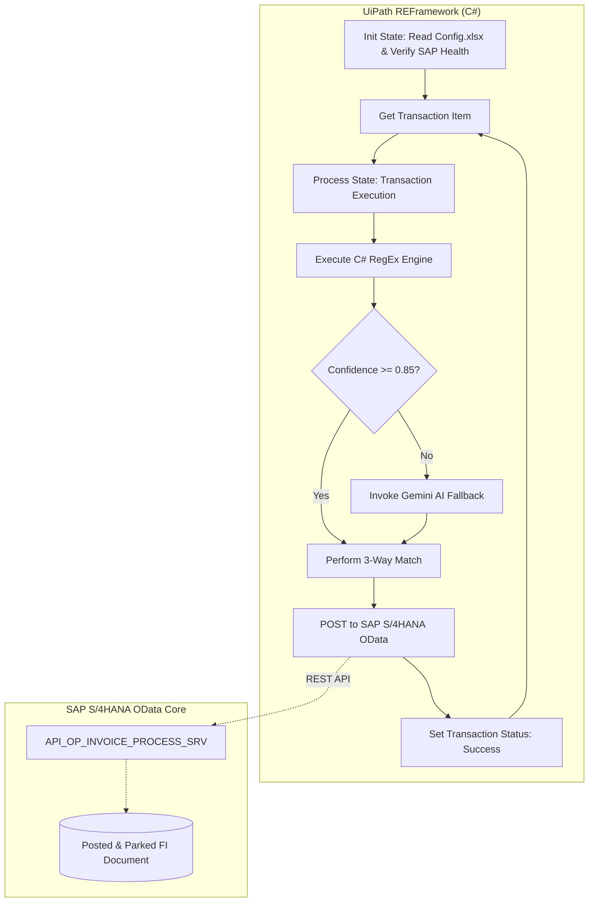

# Enterprise RPA Financial & Invoice Reconciliation System

[-orange.svg?logo=uipath)](https://www.uipath.com/)
[](https://dotnet.microsoft.com/)
[](https://www.sap.com/)
[](https://www.python.org/)
[](https://fastapi.tiangolo.com/)
[](LICENSE)
[](https://github.com/JayNabasu)

An unattended enterprise Robotic Process Automation (RPA) solution built with **UiPath Robotic Enterprise Framework (REFramework)** using **C#**. It delivers high-throughput financial invoice extraction, automated Nigerian VAT (7.5%) & WHT withholding reconciliation, and automated document posting into **SAP S/4HANA** (FI/MM modules) via OData APIs.

---

## Key Highlights & Architectural Features

- **Enterprise REFramework in C#**: Production-grade state machine ensuring robust transaction management, configurable retry scopes, and segregation of business vs system exceptions.
- **Compiled High-Performance C# RegEx Engine**: Custom class library (`EnterpriseRPA.RegexEngine`) utilizing precompiled regular expressions for multi-currency invoice subtotals, FIRS Tax IDs (TIN), SAP PO numbers (`4500######`), and WBS/Cost Centers.
- **Dual-Mode AI Extraction (Gemini / Vertex AI)**: Incorporates intelligent fallback to multimodal Large Language Models when documents contain non-standard formatting or scan degradation below confidence threshold (`< 0.85`).
- **SAP S/4HANA OData Mock Server**: Lightweight FastAPI implementation of standard SAP ERP OData endpoints (`API_OP_INVOICE_PROCESS_SRV`) allowing complete offline verification of 3-way matching and document posting without requiring live SAP infrastructure.
- **Enterprise IT Governance**: Complete [Solution Design Document (SDD)](docs/SDD_Invoice_Reconciliation_v1.0.md) authored to enterprise governance and security compliance standards.

---

## Architecture & Process Flow



---

## Repository Structure

```text
enterprise-rpa-financial-reconciliation/
├── CustomActivities/
│   ├── InvoiceRegexEngine/              # C# Class Library (.NET 8.0/10.0)
│   │   ├── RegexParser.cs              # Compiled RegEx patterns & math checks
│   │   └── InvoiceRegexEngine.csproj
│   └── InvoiceRegexEngine.Tests/        # xUnit Test Suite
│       ├── ParserTests.cs              # Unit tests for multi-currency invoices
│       └── InvoiceRegexEngine.Tests.csproj
├── EnterpriseReconciliationBot/         # UiPath Studio Project
│   ├── project.json                    # Project dependencies & runtime config
│   ├── Main.xaml                       # REFramework State Machine
│   ├── Process.xaml                    # Business logic execution
│   ├── Data/
│   │   ├── Config.xlsx                 # Enterprise configuration workbook
│   │   └── generate_config.py          # Automated configuration generator
│   └── Services/
│       └── GeminiAiFallback.xaml       # REST AI extraction fallback
├── mock_sap_server/                     # SAP S/4HANA Mock API Server
│   ├── app.py                          # FastAPI OData simulation
│   └── test_mock_sap.py                # pytest validation suite
├── docs/
│   └── SDD_Invoice_Reconciliation_v1.0.md # Signed Solution Design Document
├── .gitignore
└── README.md
```

---

## Quick Start & Verification

### 1. Run C# RegEx Engine Unit Tests
Verify the compiled regular expressions and mathematical reconciliation rules:
```powershell
cd CustomActivities/InvoiceRegexEngine.Tests
dotnet test
```

### 2. Run Mock SAP S/4HANA ERP Server
Start the mock SAP OData service on port 8000:
```powershell
cd mock_sap_server
python -m uvicorn app:app --reload --port 8000
```
Run the automated validation tests:
```powershell
python -m pytest test_mock_sap.py
```

### 3. Open UiPath Studio
1. Open `EnterpriseReconciliationBot/project.json` in **UiPath Studio 2024.10+**.
2. Confirm package restoration (`UiPath.WebAPI.Activities`, `UiPath.Excel.Activities`).
3. Run `Main.xaml` in Debug or Run mode.

---

## Author & Contact

**Jerry A. Nabasu**  
- **Role**: Automation & Digital Innovation Professional  
- **Certifications**: GInI Certified Innovation Strategist (CInS), GInI Certified Innovation Professional (CInP), UiPath Advanced Developer (Romania 2024)  
- **GitHub**: [@JayNabasu](https://github.com/JayNabasu)  
- **Email**: [jerrynabasu@gmail.com](mailto:jerrynabasu@gmail.com)
