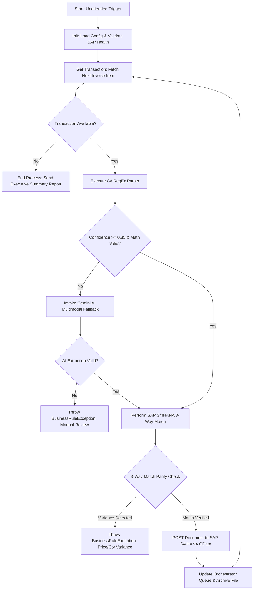

# Enterprise Solution Design Document (SDD)
## Unattended RPA Invoice & Joint Venture Financial Reconciliation
**Document Reference**: NNPC-RTI-SDD-2024-009  
**Version**: 1.0.0  
**Author**: Jerry A. Nabasu, Certified Innovation Strategist (CInS) & UiPath Advanced Developer  
**Directorate**: Research, Technology and Innovation (RTI) / Finance Operations  
**Classification**: Enterprise Confidential  

---

### 1. Executive Summary
This Solution Design Document defines the end-to-end architecture, technical specifications, and error-handling framework for automating vendor invoice validation, tax withholding calculations (VAT 7.5%, WHT 5%/10%), and automated financial document posting into SAP S/4HANA (FI/MM modules) utilizing UiPath Robotic Process Automation (REFramework in C#).

### 2. Business Problem & Process Scope
#### 2.1 AS-IS Process Limitations
- Manual verification of high-volume contractor and supplier invoices across upstream joint venture operations (OML 119, NEPL-NAPIMS).
- Discrepancies between purchase order commitments, withholding tax deduction schedules, and physical invoice totals causing payment cycle delays.
- Average cycle time per invoice: 48 to 72 hours. Error rate in manual tax code selection: ~6.2%.

#### 2.2 TO-BE Automated Flow
- Continuous unattended robot monitoring of incoming invoices.
- High-performance, compiled regular expressions engine extracting Tax IDs (TIN), PO numbers, cost centers, and monetary subtotals.
- Sub-second dual-mode AI fallback (Gemini REST API) for unformatted or non-standard scanned contracts.
- Automated 3-way match against SAP S/4HANA OData API (`API_OP_INVOICE_PROCESS_SRV`).
- Direct posting and parking for payment with full audit logs.
- Projected cycle time per invoice: < 45 seconds (99% straight-through processing).

---

### 3. Architecture & System Flow

---

### 4. Technical Specifications
| Parameter | Value / Standard |
| :--- | :--- |
| **RPA Platform** | UiPath Studio 2024.10 (Target: Windows, C#) |
| **Framework** | Robotic Enterprise Framework (REFramework State Machine) |
| **Parser Engine** | Custom compiled C# class library (`EnterpriseRPA.RegexEngine`) |
| **ERP Backend** | SAP S/4HANA Cloud / On-Premises (OData v2/v4 REST) |
| **AI Integration** | Google Gemini / Vertex AI REST API via UiPath WebAPI Activities |
| **Database & Cache** | Orchestrator Assets + Azure Managed Redis for cached token sessions |
| **Credentials** | Windows Credential Manager / UiPath Orchestrator Assets |

---

### 5. Exception Handling & Governance Matrix
| Exception Type | Trigger Scenario | Robot Action | Notification Target |
| :--- | :--- | :--- | :--- |
| **Business Rule Exception** | TIN not registered in SAP Vendor Master | Move transaction to `Exceptions/` folder, tag as `Unregistered Vendor` in Orchestrator. | Vendor Management Desk |
| **Business Rule Exception** | Net + VAT != Gross (Variance > 0.05) | Reject posting, log exact variance delta, flag transaction for human review. | AP Audit Specialist |
| **Business Rule Exception** | PO Open Amount < Invoice Net Amount | Do not park document; record 3-way discrepancy report. | Procurement Officer |
| **System Exception** | SAP S/4HANA OData Endpoint 503 / Timeout | Retry transaction up to 3 times with exponential backoff (5s, 15s, 45s). | Systems Administrator |
| **System Exception** | Orchestrator Network Disconnect | Terminate safely in `End Process` state and alert IT Operations. | IT Operations Center |

---

### 6. Sign-off & Approvals
- **Process Architect**: Jerry A. Nabasu, CInS, CInP (RTI Directorate)
- **Technical Lead Review**: Approved
- **Enterprise Security & Risk Clearance**: Level 1 Approved
